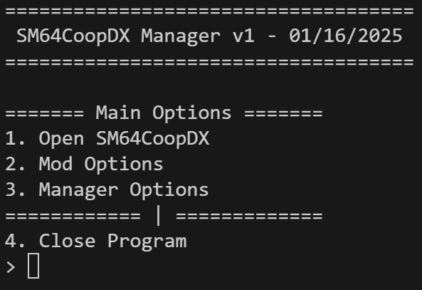

# SquishyCoopManager
### A tool made for managing SM64CoopDX and it's mods

## Goals:
1. (Achieved) A User-Friendly console based mod organizer made to improve Loading / Mod Cache times
2. (WIP) An Automatic SM64CoopDX Update Notifier and Installer

## Current Functionality:
1. Mod Organization
2. Mass Mod Loading / Unloading
3. Automatic Mod Backups
4. Improved Mod Caching Times (Dependant on Mods loaded)
5. Booting SM64CoopDX from Launcher
6. Automatic Python Package Instalation

## Planned Functionality:
1. Automatic SM64CoopDX Update Installation
2. (?) Automatic Mod Update Installation
